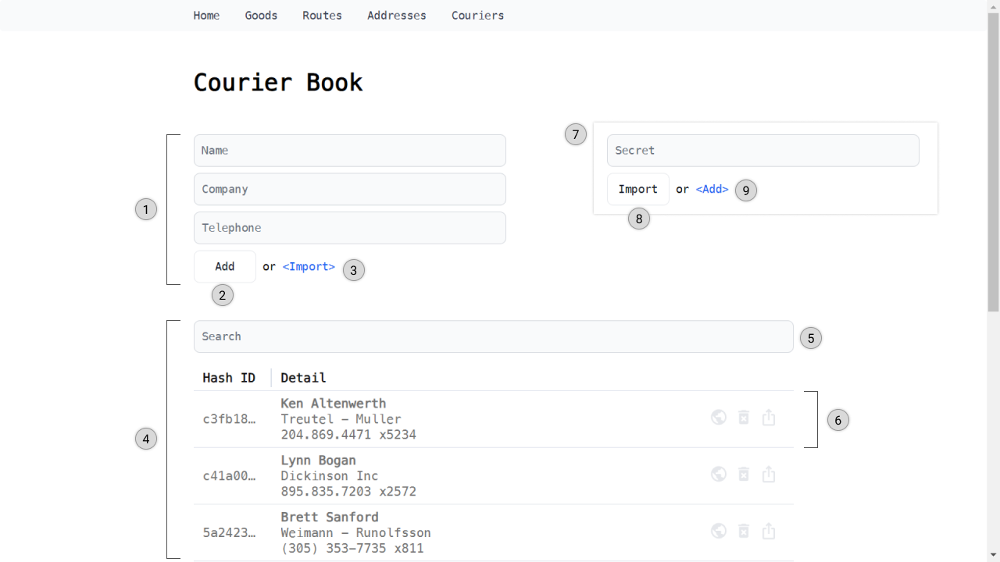
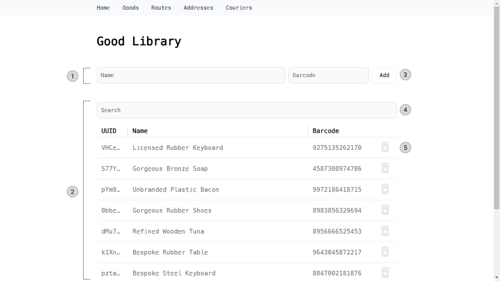
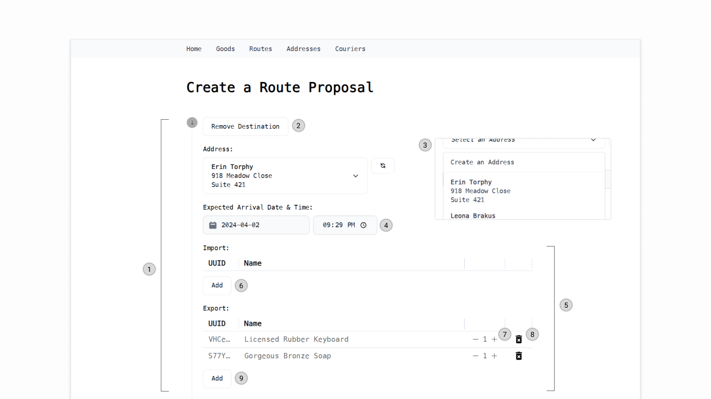
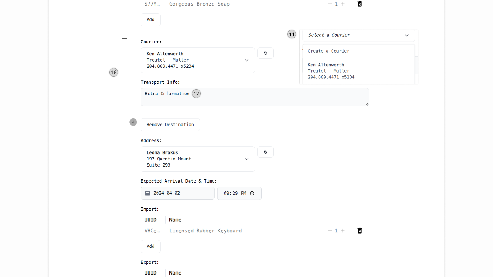
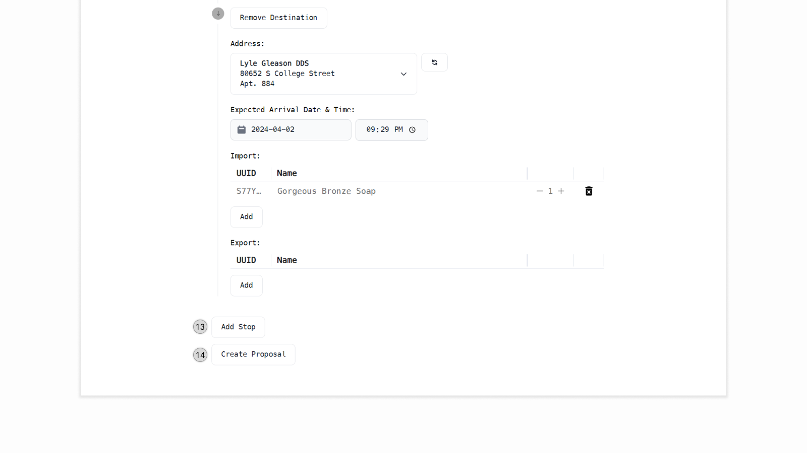
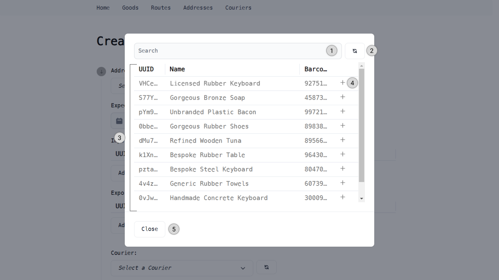

## Introduction

CryptoExpress-Portal is a web-based portal that harnesses the capabilities of Hyperledger Fabric to establish a private blockchain system dedicated to managing goods delivery. It allows users to set up a web portal on any device with a web browser, including desktops, laptops, tablets, and mobile phones.

It is a powerful and flexible multi-purpose delivery route manager/planner that allows users to manage addresses, couriers, and route status by calling the chaincode to update the world state.

## Glossary

### Route

A route represents a delivering route consisting of multiple stops, delivering one or many goods from multiple sources to multiple destinations.

Locations with import and export operations are called Stops. A stop may receive goods from a courier, deliver goods to a courier, or both at the exact location. The following information is included in a route for each stop: When should the courier arrive? Where should the stop be? And what should be received and sent out?

Transportation is needed for goods to be delivered from one stop to another. Couriers are responsible for transporting goods between stops. A route may involve multiple couriers since each pair of stops may have different couriers. For each pair of stops, questions like how the goods should be delivered and who the courier is should be answered.

### Route Segment

A Route Segment is a Transport with a pair of Stops.

### Route Proposal

A proposal for a route, including the route itself and signatures from the involved addresses/couriers, as a map of hash IDs to signatures. This signature will be the route signed by the private key of the corresponding party, and the proposal can only be submitted once all involved parties' signatures have been collected.

### Proposal Signature

A route proposal must first be established to initiate the creation of a route. This proposal encompasses essential route details, including the source and destination addresses, the courier responsible for the delivery, the goods to be delivered, and the expected delivery timeline.

After a route proposal is created, the route proposal needs to be signed by all involved entities. This includes all addresses associated with the stops and the couriers assigned to each transport. The necessity for this signature process stems from the requirement to ensure that every entity involved has consented to the route's specifics.

The route proposal is signed using the corresponding entity's private key, thereby confirming their acknowledgment and agreement with the route's details. All involved entities must sign the proposal to validate their consent and to ensure the route's legitimacy.

Upon the completion of the signature process by all involved entities, the route proposal can then be officially submitted.

### Company

An entity with a set of couriers and addresses.

### Address/Courier Ownership

Any company with the address/courier with the correct private key in their internal database owns this specific address/courier.

### Address & Courier

Courier and address both serve as identifiers within the system, with the courier focusing on the transportation courier and the address representing physical locations. Each entity is stored in the company's internal database, accompanied by a private key for ownership verification.

Upon creation, both created address/courier are stored in the internal database and can be made public by sharing them without the private key via chaincode, making them accessible to all entities in the blockchain network.

When constructing a route proposal, the address and courier are selected from the courier book (for transport) and address book (for stop). The proposal then needs to be signed with the corresponding private key to confirm acknowledgment of the route by the corresponding company, which owns the set of private keys of the involved addresses and couriers. This ensures secure and authenticated agreement and consensus with the route's details, facilitating the identification and verification of couriers and addresses within the system.

### Address & Courier Book

The Address and Courier Book are comprehensive collections encompassing internal and external entities.

Internal entities, whether addresses or couriers, are retrieved from an internal database and must be accompanied by a private key for ownership verification and signing.

External entities, accessed via chain code to read from the world state, are provided with only a public key, enabling signature validation for the corresponding entity. This dual approach ensures secure and authenticated interactions within the system, facilitating the identification and verification of addresses and couriers.

### Good

Good is used to define a trade item as products or services that are being referred to in the delivery process. It has a unique identifier (UUID), name, and barcode. Each company has its internal database to store a set of good definitions. When creating a new route, the definitions are selected from the internal database and used in the route. The UUID must be unique under the company and route.

Good serves as a reference to the actual product or service that is being delivered. A record in the internal database doesn't mean the actual product or service is in the warehouse or store, nor does it mean the company owns the product or service.

The barcode is used to identify the product or service in the real world during check-in and check-out. Global Trade Item Number (GTIN) can be used as the barcode to uniquely identify all the goods.


### Commit

Commit describes a specific moment on the route for the delivery. The described moment can be the status of the source outgoing, courier receiving, courier delivering, and destination incoming. It encompasses details of the moment, including changes in goods quantities (delta), additional information, a timestamp indicating the actual time of this state, and a signature for the entity corresponding to the specific moment.

In practical scenarios, when the delivery reaches one of these four statuses in the real world, the company owning the corresponding entity (address/courier) signs the commit detail to ensure its identification, verification, and agreement. Subsequently, a commit marking the completion of this specific moment for the route is released via the company chaincode.

## World State Data Storage/Retrieval

In the world state, we have set standards for the key map with the object stored. For details, please see the readme file at [CryptoExpress-ChainCode](https://github.com/Jerrylum/CryptoExpress-Chaincode)

## Features

- Manage Route on the world state
  - Create a new route proposal
  - Remove a route proposal
  - Sign route proposal with an internal private key
  - Submit a completely signed route proposal
  - Commit to progress
- Manage Addresses on the world state
  - Create a new Address
  - Remove an existing Address
- Manage Couriers on the world state
  - Create a new Courier
  - Remove an existing Courier

## Getting Started

### Pre-requisites

A Linux instance with at least 2 vCPUs, 4 GB RAM, and 4 GB storage. Linux distribution `Ubuntu 22.04.3 LTS` is used in this guide.

### Install Node.js

Run the following commands to install Node Version Manager (NVM) and Node.js 18.17.

```bash
cd ~
curl -o- https://raw.githubusercontent.com/nvm-sh/nvm/v0.39.7/install.sh | bash
nvm install 18.17
nvm use 18.17

# Update the symbolic links for node and npm
# This is to ensure that the correct version of node and npm are used
# It is necessary to run this command for the chaincode compilation later
sudo rm -f /usr/bin/node
sudo rm -f /usr/bin/npm
sudo ln -s $(which node) /usr/bin/
sudo ln -s $(which npm) /usr/bin/
```

### Pull Network Repo & Chaincode & Portal

Run the following commands to clone the CryptoExpress-Chaincode, CryptoExpress-Network, and CryptoExpress-Portal repositories.

```bash
cd ~
git clone https://github.com/Jerrylum/CryptoExpress-Chaincode.git
git clone https://github.com/Jerrylum/CryptoExpress-Network.git
git clone https://github.com/Jerrylum/CryptoExpress-Portal.git
```

### Setup Development Network

Run the following commands to set up the development network.

```bash
cd ~/CryptoExpress-Network
./install.sh
```

### Deploy Chaincode to the Development Network

```bash
cd ~/CryptoExpress-Network/test-network
./init.sh ~/CryptoExpress-Chaincode
```

### Run the Portal

Modify the `.env` file in the `CryptoExpress-Portal` directory to match the configuration of the development network.

```
COMPANY_NAME=Company A
CHANNEL_NAME=mychannel
CHAINCODE_NAME=basic
MSP_ID=Org1MSP
CRYPTO_PATH=/home/ubuntu/CryptoExpress-Network/test-network/organizations/peerOrganizations/org1.example.com
KEY_DIRECTORY_PATH="${CRYPTO_PATH}/users/User1@org1.example.com/msp/keystore"
CERT_PATH="${CRYPTO_PATH}/users/User1@org1.example.com/msp/signcerts/cert.pem"
TLS_CERT_PATH="${CRYPTO_PATH}/peers/peer0.org1.example.com/tls/ca.crt"
PEER_ENDPOINT=localhost:7051
PEER_HOST_ALIAS=peer0.org1.example.com
```

Run the following commands to start the portal.

```bash
cd ~/CryptoExpress-Portal
npm install
npm run dev
```

## User Interface
CryptoExpress-Portal is designed to provide a user-friendly interface for managing routes, addresses, and couriers. The platform is built with simplicity and ease of use in mind, ensuring that users can access the functionalities with minimal effort.

### Home Page
The home page serves as the gateway to the portal, featuring a clean and intuitive layout. It includes six components that lead to different pages of the portal.


1. `Address Book Access Point`: The gateway to the Address Book page.
2. `Courier Book Access Point`: The gateway to the Courier Book page.
3. `Good Library Access Point`: The gateway to the Good Library page.
4. `Route List Access Point`: The gateway to the Route List page.
5. `Route Creation Access Point`: The gateway to the Route Creation page.
6. `Navigation Bar`: The main navigation menu for all pages.

### Address Page
The Address Page is the central hub for managing the address book within the CryptoExpress-Portal. It seamlessly integrates with the blockchain to fetch all public addresses via the chaincode and retrieves addresses from the internal database.

One of the key features of the Address Page is its support for filtering addresses based on specific details of the address, ensuring users can easily locate and manage the addresses they are interested in. 

Additionally, the Address Page empowers users to create new internal addresses. This can be achieved by either manually entering the details of the new address or by providing a JSON string of the address, accompanied by a valid private key. 

For each address record, the Address Page provides a set of action buttons on the right side. These buttons enable users to execute various operations including releasing or unlisting an internal or public address, removing an address from the internal database, and exporting an internal address as a JSON string object. 


1. `New Internal Address Section (Manually Input)`: Activated upon the Navigate-to-Input Button, the section creates a new address to the internal database by detailing the necessary information (recipient, lines 1, 2) required.
2. `Add Button`: The button to create a new internal address based on the inputted address details.
3. `Navigate-to-Import Button`: The toggle button navigates to the import address section.
4. `Address Book`: The section presents a grid layout for displaying addresses from the address book, accompanied by a search bar and action buttons for each record. Users can select a Hash ID to copy the address value.
5. `Search Bar`: An input field intended for filtering the address book's results based on the user's query.
6. `Action Buttons (for each address record)`:
    1. `Unlist Address Button`: The button removes a public address from the world state.
    2. `Release Address Button`: The button makes a target internal address available in the world state.
    3. `Remove from Internal Button`: The button deletes an internal address.
    4. `Export Secret Button`: The button exports the target internal address as a JSON string to the clipboard.
7. `New Internal Address Section (Import)`: Activated upon the Navigate-to-Import Button, the section creates a new address to the internal database by providing a JSON string object of address with the valid secret key.
8. `Import Button`: The button to import a new address to the internal database based on the inputted secret. This process includes validating the input JSON string object for the secret key's validity, structure, and attribute types.
9. `Navigate-to-Input Button`: The toggle button navigates to the manual input section.

### Courier Page
The Courier Page serves as the central hub for managing the courier book within the CryptoExpress-Portal. It seamlessly integrates with the blockchain to fetch all public couriers via the chaincode and retrieves couriers from the internal database.

A key feature of the Courier Page is its ability to filter couriers based on specific details, making it easy for users to locate and manage the couriers they are interested in.

Furthermore, the Courier Page allows users to create new internal couriers. This can be done by manually entering the new courier's details or by providing a JSON string of the courier, along with a valid private key.

For each courier record, the Courier Page offers a set of action buttons on the right side. These buttons enable users to perform various operations, including releasing or unlisting an internal or public courier, removing a courier from the internal database, and exporting an internal courier as a JSON string object.



1. `New Internal Courier Section (Manually Input)`: Activated upon the Navigate-to-Input Button, the section creates a new courier to the internal database by detailing the necessary information (name, email) required.
2. `Add Button`: The button to create a new internal courier based on the inputted courier details.
3. `Navigate-to-Import Button`: The toggle button navigates to the import courier section.
4. `Courier Book`: The section presents a grid layout for displaying couriers from the courier book, accompanied by a search bar and action buttons for each record. Users can select a Hash ID to copy the courier value.
5. `Search Bar`: An input field intended for filtering the courier book's results based on the user's query.
6. `Action Buttons (for each courier record)`:
    1. `Unlist Courier Button`: The button removes a public courier from the world state.
    2. `Release Courier Button`: The button makes a target internal courier available in the world state.
    3. `Remove from Internal Button`: The button deletes an internal courier.
    4. `Export Secret Button`: The button exports the target internal courier as a JSON string to the clipboard.
7. `New Internal Courier Section (Import)`: Activated upon the Navigate-to-Import Button, the section creates a new courier to the internal database by providing a JSON string object of courier with the valid secret key.
8. `Import Button`: The button to import a new courier to the internal database based on the inputted secret. This process includes validating the input JSON string object for the secret key's validity, structure, and attribute types.
9. `Navigate-to-Input Button`: The toggle button navigates to the manual input section.

### Good Page
The Good Page is the central hub for managing the local internal goods database. It enables users to add new goods, including their details such as name and barcode, to the database. Each good is assigned a unique identifier (UUID) for identification and is displayed in a grid layout.



1. `New Good Creation Section`: The section creates a new good definition for the internal database by detailing the necessary information (name, barcode) required.
2. `Good Library`: The section presents a grid layout for displaying goods from the internal database, accompanied by a search bar and remove button for each record.
3. `Add Button`: The button to create a new good definition to the internal database based on the inputted goods details.
4. `Search Bar`: An input field intended for filtering the Good Library's results based on the user's query.
5. `Remove Button`: The button to remove a good definition from the internal database.

### Route Creation Page
The Route Creation Page is designed to facilitate the creation of new route proposals. It provides a user-friendly interface for users to input the necessary details for a route, including the source and destination addresses, the courier responsible for the delivery, the goods to be delivered, and the expected delivery timeline.







1. `Stop Detail`: The section allows users to select the address for the current stop, setting the expected arrival time for the courier, and the export/import goods at each stop.
2. `Remove Destination Button`: The button to remove the selected stop from the route.
3. `Address Book Dropdown`: The dropdown menu to select the address from the address book. The `Create an Address` button can open a new page for creating a new address on the address page, and a `Refresh` button to refresh the list after creating a new address.
4. `Expected Arrival Time`: The input field sets the expected arrival date and time for the courier at the selected address. The date and time must be later than the previous stop. To ensure the validity of the date and time, the system will adjust the value if needed.
5. `Import & Export`: The section allows users to select the goods to be exported/imported at each stop. The goods are selected from the good library.
6. `Add Import Good Button`: The button to open the [Good Selection Modal](#good-selection-modal) to select the goods to be imported at the selected stop.
7. `Increase/Decrease Button`: The buttons to increase or decrease the quantity.
8. `Remove Good Button`: The button to remove the selected good item.
9. `Add Export Good Button`: The button to open the [Good Selection Modal]((#good-selection-modal)) to select the goods to be exported at the selected stop.
10. `Transport Detail`: The section allows users to select the courier responsible for the delivery between each pair of stops. An extra information field is provided for additional information to the courier.
11. `Courier Book Dropdown`: The dropdown menu to select the courier from the courier book. The `Create a Courier` button can open a new page for creating a new courier on the courier page, and a `Refresh` button to refresh the list after creating a new courier.
12. `Transport Info`: The input field provides additional information to the courier, such as the type of transportation or any other relevant details.
13. `Add Stop Button`: The button to add a new stop at the end of the current route.
14. `Create Proposal Button`: The button to create a new route proposal based on the inputted route details. The proposal will be pushed to the world state and wait for all involved parties' signatures and the submission.

### Good Selection Modal
The Good Selection Modal is a pop-up window that allows users to select the goods to be imported/exported at each stop. It provides a user-friendly interface for users to browse the good library and select the desired goods.



### Route List Page

### Route Commit Page